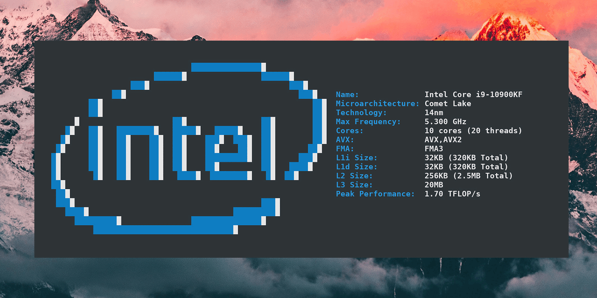
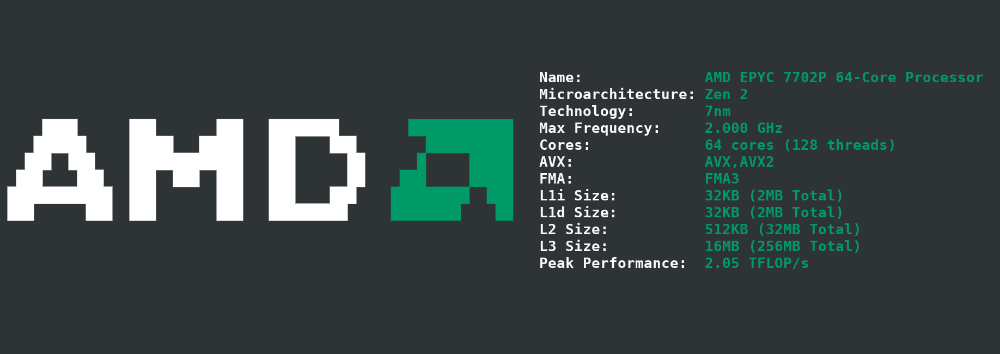
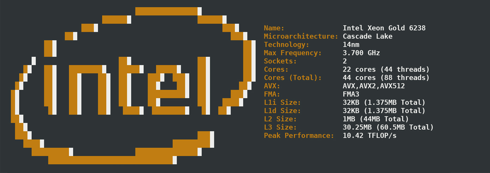
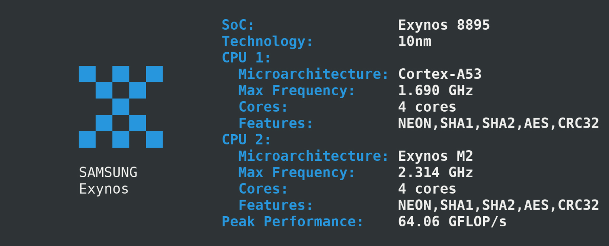
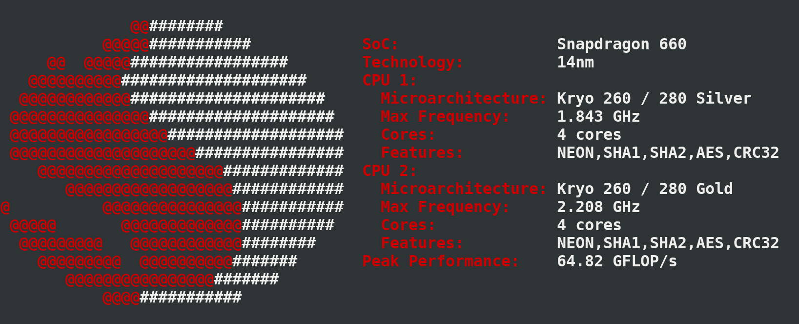
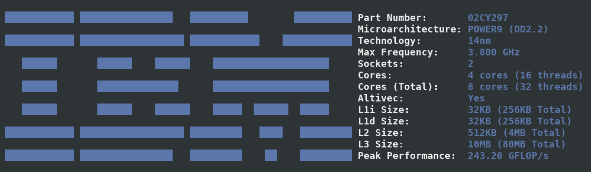

<p align="center"></p>

<h4 align="center">Simple yet fancy CPU architecture fetching tool</h4>

<p align="center"> </p>

<div align="center">
  
  <a href="https://github.com/Dr-Noob/cpufetch/stargazers">
    
  </a>
  <a href="https://github.com/Dr-Noob/cpufetch/issues">
    
  </a>
  <a href="https://github.com/Dr-Noob/cpufetch/blob/master/README.md#1-support">
    
  </a>
  <a href="https://github.com/Dr-Noob/cpufetch/blob/master/LICENSE">
    
  </a>
</div>

<p align="center"> </p>

<p align="center">
cpufetch is a command-line tool written in C that displays the CPU information in a clean and beautiful way
</p>

<p align="center">

</p>

# Table of contents
<!-- UPDATE with: doctoc --notitle README.md -->
<!-- START doctoc generated TOC please keep comment here to allow auto update -->
<!-- DON'T EDIT THIS SECTION, INSTEAD RE-RUN doctoc TO UPDATE -->


- [1. Support](#1-support)
- [2. Installation](#2-installation)
  - [2.1 Installing from a package](#21-installing-from-a-package)
  - [2.2 Building from source](#22-building-from-source)
  - [2.3 Android](#23-android)
- [3. Examples](#3-examples)
  - [3.1 x86_64](#31-x86_64)
  - [3.2 ARM](#32-arm)
  - [3.3 PowerPC](#33-powerpc)
- [4. Colors](#4-colors)
  - [4.1 Specifying a name](#41-specifying-a-name)
  - [4.2 Specifying the colors in RGB format](#42-specifying-the-colors-in-rgb-format)
- [5. Implementation](#5-implementation)
- [6. Bugs or improvements](#6-bugs-or-improvements)
- [7. Acknowledgements](#7-acknowledgements)
- [8. cpufetch for GPUs (gpufetch)](#8-cpufetch-for-gpus-gpufetch)

<!-- END doctoc generated TOC please keep comment here to allow auto update -->

## 1. Support

| OS          | x86_64 / x86       | ARM                | RISC-V             | PowerPC            |
|:-----------:|:------------------:|:------------------:|:------------------:|:------------------:|
| GNU / Linux | :heavy_check_mark: | :heavy_check_mark: | :heavy_check_mark: | :heavy_check_mark: |
| Windows     | :heavy_check_mark: | :x:                | :x:                | :x:                |
| Android     | :heavy_check_mark: | :heavy_check_mark: | :x:                | :x:                |
| macOS       | :heavy_check_mark: | :heavy_check_mark: | :x:                | :heavy_check_mark: |
| FreeBSD     | :heavy_check_mark: | :x:                | :x:                | :x:                |

**NOTES:**
- Colors will be used in Windows only if the terminal supports it.
- Support in macOS ARM is limited to Apple chips only

## 2. Installation
### 2.1 Installing from a package
Choose the right package for your operating system:

[](https://repology.org/project/cpufetch/versions)

If there is no available package for your OS, you can download the cpufetch binary from [the releases page](https://github.com/Dr-Noob/cpufetch/releases), or [build cpufetch from source](#22-building-from-source-linuxwindowsmacos) (see below).

### 2.2 Building from source
You will need a C compiler (e.g, `gcc`) and `make` to compile `cpufetch`. Just clone the repo and run `make`:

```
git clone https://github.com/Dr-Noob/cpufetch
cd cpufetch
make
./cpufetch
```

### 2.3 Android
1. Install `termux` app (terminal emulator)
2. Run `pkg install -y git make clang` inside termux.
3. Build from source normally:
  - git clone https://github.com/Dr-Noob/cpufetch
  - cd cpufetch
  - make
  - ./cpufetch

## 3. Examples
### 3.1 x86_64

<p align="center"></p>
<p align="center">AMD EPYC HPC server</p>
<p align="center"></p>
<p align="center">Intel Xeon HPC server</p>

### 3.2 ARM

<p align="center">

&nbsp;

</p>
<p align="center">Samsung Galaxy S8 (left) Xiaomi Redmi Note 7 (right)</p>

### 3.3 PowerPC

<p align="center"></p>
<p align="center">Talos II</p>

## 4. Colors
By default, `cpufetch` will print the CPU logo with the system colorscheme. However, you can set a custom color scheme in two different ways:

### 4.1 Specifying a name

 By specifying a name, cpufetch will use the specific colors of each manufacture. Valid values are:

- intel
- intel-new
- amd
- ibm
- arm

```
./cpufetch --color intel (default color for Intel)
```

### 4.2 Specifying the colors in RGB format

5 colors must be given in RGB with the format: ``[R,G,B:R,G,B:R,G,B:R,G,B:R,G,B]``. These colors correspond to the CPU logo color (first 3 colors) and for the text colors (following 2).

```
./cpufetch --color 239,90,45:210,200,200:0,0,0:100,200,45:0,200,200
```

## 5. Implementation
See [cpufetch programming documentation](https://github.com/Dr-Noob/cpufetch/tree/master/doc).

## 6. Bugs or improvements
See [cpufetch contributing guidelines](https://github.com/Dr-Noob/cpufetch/blob/master/CONTRIBUTING.md).

## 7. Acknowledgements
Thanks to the fellow contributors and interested people in the project. Special thanks to:
- [Gonzalocl](https://github.com/Gonzalocl) and [OdnetninI](https://github.com/OdnetninI): Tested cpufetch in the earlier versions of the project in many different CPUs.
- [Kyngo](https://github.com/Kyngo): Tested cpufetch in the Apple M1 CPU.
- [avollmerhaus](https://github.com/avollmerhaus): Helped with PowerPC port giving ssh access to a PowerPC machine.
- [bbonev](https://github.com/bbonev) and [stephan-cr](https://github.com/stephan-cr): Reviewed the source code.
- [mdoksa76](https://github.com/mdoksa76) and [exkc](https://github.com/exkc): Excellent ideas and feedback for supporting Allwinner SoCs.
- [Sakura286](https://github.com/Sakura286), [exkc](https://github.com/exkc) and [Patola](https://github.com/Patola): Helped with RISC-V port with ssh access, ideas, testing, etc.

## 8. cpufetch for GPUs (gpufetch)
See [gpufetch](https://github.com/Dr-Noob/gpufetch) project!
