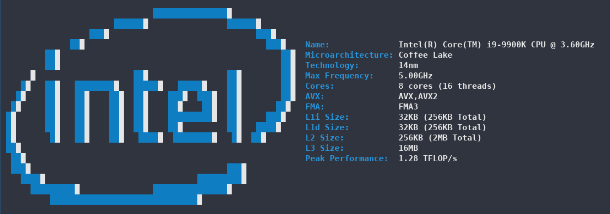
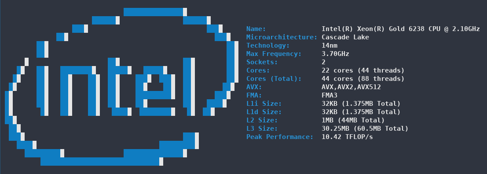

# cpufetch

Simplistic yet fancy CPU architecture fetching tool


### Platforms
cpufetch currently supports x86 CPUs (both Intel and AMD CPUs)

| Platform  | Intel                     | AMD                      | Notes             |
|:---------:|:-------------------------:|:------------------------:|:-----------------:|
| Linux     | :heavy_check_mark:        | :heavy_check_mark:       | Prefered platform |
| Windows   | :heavy_check_mark:        | :heavy_check_mark:       | Some information may be missing. <br> No colors and worse CPU art |
| macOS     | :heavy_exclamation_mark:  | :heavy_exclamation_mark: | Untested |


### Usage and installation
#### Linux
There is a cpufetch package available in Arch Linux ([cpufetch-git](https://aur.archlinux.org/packages/cpufetch-git)).

If you are in other distro, you can build `cpufetch` from source (see below)

#### Windows
In the [releases](https://github.com/Dr-Noob/cpufetch/releases) section you will find some cpufetch executables compiled for Windows. Just download and run it from Windows CMD.

#### Building from source
Just clone the repo and use `make` to compile it

```
git clone https://github.com/Dr-Noob/cpufetch
cd cpufetch
make
./cpufetch
```

The Makefile is designed to work on both Linux and Windows.

### Example

Here are more examples of how `cpufetch` looks on different CPUs.




### Colors and style
By default, `cpufetch` will print the CPU art with the system colorscheme. However, you can always set a custom color scheme, either
specifying Intel or AMD, or specifying the colors in RGB format:

```
./cpufetch --color intel (default color for Intel)
./cpufetch --color amd (default color for AND)
./cpufetch --color 239,90,45:210,200,200:100,200,45:0,200,200 (example)
```

In the case of setting the colors using RGB, 4 colors must be given in with the format: ``[R,G,B:R,G,B:R,G,B:R,G,B]``. These colors correspond to CPU art color (2 colors) and for the text colors (following 2). Thus, you can customize all the colors.

### Implementation

`cpufetch` fetches all of the information using the `CPUID` x86 instruction. There are, however, some cases where the CPU does not support fetching some needed information. In this case, `cpufetch` will use `/sys/devices/system/cpu` in Linux as a fallback. If `cpufetch` is running on Windows and `CPUID` does not give all the data, `cpufetch` won't be able to show it. [I hope this can be fixed in the future](https://github.com/Dr-Noob/cpufetch/issues/30)

### Bugs or improvements
There are many open issues in github (see [issues](https://github.com/Dr-Noob/cpufetch/issues)). Feel free to open a new one report a issue or propose any improvement in `cpufetch`

### Testers
I would like to thank [Gonzalocl](https://github.com/Gonzalocl) and [OdnetninI](https://github.com/OdnetninI) for their help, running `cpufeth` in many different CPUs they have access to, which makes it easier to debug and check the correctness of `cpufetch`.
