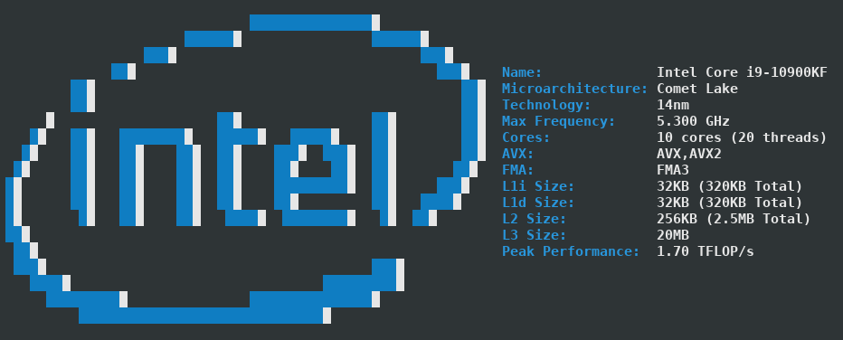
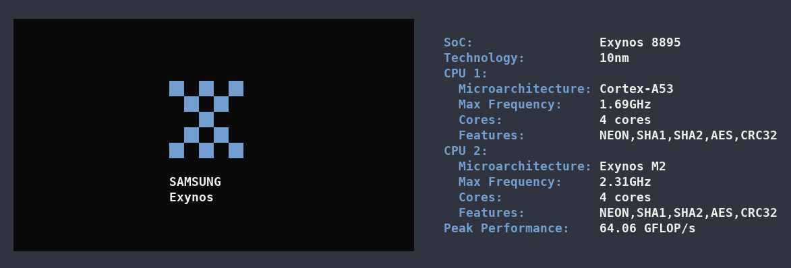
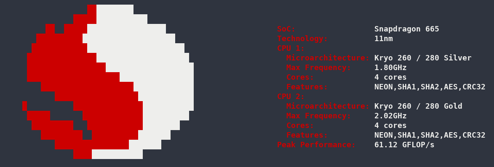

<p align="center"></p>

<div align="center">


[](https://opensource.org/licenses/MIT)

<h4 align="center">Simple yet fancy CPU architecture fetching tool</h4>
&nbsp;



</div>

# Table of contents
<!-- UPDATE with: doctoc --notitle README.md -->
<!-- START doctoc generated TOC please keep comment here to allow auto update -->
<!-- DON'T EDIT THIS SECTION, INSTEAD RE-RUN doctoc TO UPDATE -->


- [1. Support](#1-support)
- [2. Installation](#2-installation)
  - [2.1 Building from source](#21-building-from-source)
  - [2.2 Linux](#22-linux)
  - [2.2 Windows](#22-windows)
  - [2.3 macOS](#23-macos)
  - [2.4 Android](#24-android)
- [3. Examples](#3-examples)
  - [3.1 x86_64 CPUs](#31-x86_64-cpus)
  - [3.2 ARM CPUs](#32-arm-cpus)
- [4. Colors and style](#4-colors-and-style)
- [5. Implementation](#5-implementation)
- [6. Bugs or improvements](#6-bugs-or-improvements)

<!-- END doctoc generated TOC please keep comment here to allow auto update -->

# 1. Support
cpufetch supports x86, x86_64 (Intel and AMD) and ARM.

| Platform  | x86_64                    | ARM                | Notes             |
|:---------:|:------------------------:|:-------------------:|:-----------------:|
| GNU/Linux | :heavy_check_mark:        | :heavy_check_mark: | Best support      |
| Windows   | :heavy_check_mark:        | :x:                | Some information may be missing. <br> Colors will be used if supported |
| Android   | :heavy_exclamation_mark:  | :heavy_check_mark: | Some information may be missing. <br> Not tested under x86_64 |
| macOS     | :heavy_check_mark:        | :x:                | Some information may be missing. <br> Apple M1 support may be added <br> in the future (see [#47](https://github.com/Dr-Noob/cpufetch/issues/47))|

# 2. Installation
## 2.1 Building from source
Just clone the repo and use `make` to compile it

```
git clone https://github.com/Dr-Noob/cpufetch
cd cpufetch
make
./cpufetch
```

The Makefile is designed to work on Linux, Windows and macOS.

## 2.2 Linux
There is a cpufetch package available in Arch Linux ([cpufetch-git](https://aur.archlinux.org/packages/cpufetch-git)). If you are in another distribution, you can build `cpufetch` from source.

## 2.2 Windows
In the [releases](https://github.com/Dr-Noob/cpufetch/releases) section you will find some cpufetch executables compiled for Windows. Just download and run it from Windows CMD. You can also build `cpufetch` from source.

## 2.3 macOS
You need to build `cpufetch` from source.

## 2.4 Android
1. Install `termux` app (terminal emulator)
2. Run `pkg install -y git make clang` inside termux.
3. Build from source normally:
  - git clone https://github.com/Dr-Noob/cpufetch
  - cd cpufetch
  - make
  - ./cpufetch

# 3. Examples
Here are more examples of how `cpufetch` looks on different CPUs.

## 3.1 x86_64 CPUs


## 3.2 ARM CPUs





# 4. Colors and style
By default, `cpufetch` will print the CPU art with the system colorscheme. However, you can always set a custom color scheme, either
specifying Intel or AMD, or specifying the colors in RGB format:

```
./cpufetch --color intel (default color for Intel)
./cpufetch --color amd (default color for AMD)
./cpufetch --color 239,90,45:210,200,200:100,200,45:0,200,200 (example)
```

In the case of setting the colors using RGB, 4 colors must be given in with the format: ``[R,G,B:R,G,B:R,G,B:R,G,B]``. These colors correspond to CPU art color (2 colors) and for the text colors (following 2). Thus, you can customize all the colors.

# 5. Implementation

See [cpufetch programming documentation](https://github.com/Dr-Noob/cpufetch/blob/master/doc/README.md).

# 6. Bugs or improvements
There are many open issues in github (see [issues](https://github.com/Dr-Noob/cpufetch/issues)). Feel free to open a new one report an issue or propose any improvement in `cpufetch`

I would like to thank [Gonzalocl](https://github.com/Gonzalocl) and [OdnetninI](https://github.com/OdnetninI) for their help, running `cpufetch` in many different CPUs they have access to, which makes it easier to debug and check the correctness of `cpufetch`.
